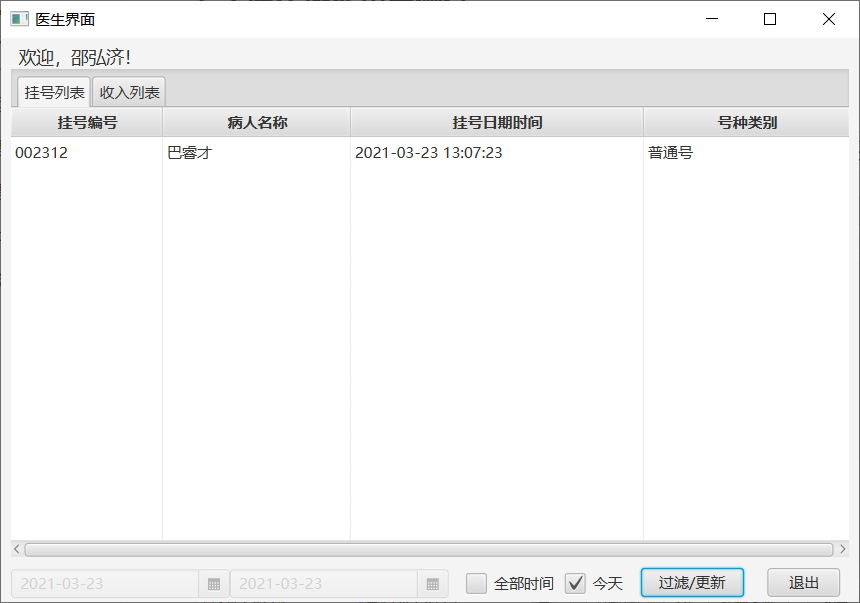

[TOC]

## Simple-Hospital-register-system

### 1. 技术选型
1. MySQL：简单，使用广泛
2. JavaFX：可以像安卓一样，将view和controller分离，不像awt一样将一些视图和控制代码都写在一起

### 2. 环境问题
#### 2.1 开发环境
1. 数据库：mysql 8.0.22  Community
2. JDK：Java11.0.8
3. javafx：javafx-sdk-11.0.2
4. 集成开发环境：IntelliJ IDEA 2020.3.2
5. 开发操作系统：Windows 10 Pro x64 Version2004

### 3. 配置问题
3.1 数据库：由于是硬性编码，因此使用的数据库名和用户名和MySQL使用的	端口都是固定的。

* 创建用户：CREATE USER 'hospital'@'localhost' IDENTIFIED BY '654321';
* 创建数据库：CREATE DATABASE hospitalManage;
* 用户授权：GRANT ALL ON hospitalManage.* TO 'hospital'@'localhost';
* 构建数据：登录用户，运行主目录下的data.sql，即：source data.sql

3.2 JavaFx配置：由于Java9开始，javafx从jdk中剥离了，而且引入模块化概念，使得运行javafx没有那么方便了需要加上参数

```java
--module-path D:\computer\java\javafx-sdk-11.0.2\lib //这是lib的位置，lib的问题需要自行解决
--add-modules javafx.controls,javafx.fxml,com.jfoenix
```

### 4. 系统设计

#### 4.1 登录界面设计

登录界面的设计较为简单，其功能为检测用户输入的登录信息是否与数据库中的登录信息相同。其应该包含一个用户名框，一个密码框，一个医生登录按钮、一个病人登录按钮以及一个退出按钮。此外，为了提高用户体验，在提示错误重新输入时需要清理掉上次提示的错误，而这些函数绑定在两个输入框的输入触发器上，这一绑定由此类的 initialize方法完成。按照 JavaFX的规范，initialize 方法会在界面初始化时被调用。

#### 4.2 Dao层设计

​		数据库连接器作为一个单例，为医生操作模块和病人操作模块提供必要的服务。这样可以简化上层的逻辑，将部分逻辑移动到底层，从而降低了整个系统的耦合度，同时便于代码的修改。选择单例模式，是为了考虑并发安全问题，单例模式保证了同一时间对数据库只有一个连接。不过这样会导致程序的并发性不高，可以考虑使用数据库连接池。

​        挂号方法使用了数据库事务管理，一旦失败就会回滚，从而不影响原有的数据。由于需要挂号编号是单调递增且连续的，因此 transaction 的隔离级别设置为 repeatableread（可重复读）

#### 4.3 病人操作界面设计

​		病人操作界面的设计是整个程序中最为复杂的部分，其大部分代码均为界面更改代码。界面包含 4 个输入/下拉框、一个滑块以及 2个复选框，输入框分别用于选择科室名称、医生姓名、号种类别以及号种名称，滑动条用于选择交款金额，两个复选框用于选择是否使用余额付款以及是否将找零存入余额。

​		复选框过滤方法：为每一个下拉框定义一个原始列表与一个当前列表，原始列表用于存放此下拉框在没有其它限制的情况下所有的可选值，而当前列表用于存放经过过滤后下拉框的候选值。进行更改操作时，根据当前更新的值，对其他复选框的当前列表进行更新！

下面是病人逻辑图


#### 4.4 医生操作界面设计

​		医生界面的逻辑就比较简单了，主要以统计查询为主，但是在界面设计的时候，因为com.jfoenix包的问题，ui界面总是出现问题，于是改成原生的ui界面

### 5. 软件测试

#### 5.1 登录测试

在数据库运作正常的情况下，启动后的界面如图所示


然后尝试不使用用户名、密码输入错误的用户名、密码登录，程序应该提示对应的错误


#### 5.2 病人操作界面测试

​		进入病人操作界面后如下图所示。其中所有的可交互控件均可同时使用鼠标和键盘进行操作。当号种类别以及号种名称被选择时，应缴金额以及找零金额会自动显示，并且找零金额会随着付款方式以及交款金额的变化而变化。当未满足挂号条件时，挂号按钮为未激活状态。


​		下面测试下拉列表的过滤效果，选择医生之后科室的种类就会固定


​		当挂号人数达到上限时会提示


​		当挂号条件满足时，挂号成功后有提示


​		在界面的友好性方面，所有的交互控件均能够同时支持鼠标和键盘操作，一个使用键盘通过输入拼音进行下拉框过滤的例子


#### 5.3 医生操作界面测试

​		进入医生界面如下图所示（因为com.jfoenix包的问题，我采用了原生javafx控件）


​		可以根据下面的控件过滤挂号的情况



​		医生收入信息统计界面如下


​		也可以进行相应的过滤


### 6. 特点与不足

#### 6.1 技术特点

* 病人操作界面使用了效率较高的过滤算法，以多个维度进行过滤，提高了程序的可用性和便捷性
* 采用了移动端的控件风格构造了一个更为人性化的操作界面
* 程序考虑到了多种异常以及并发的安全问题，健壮性强，并且程序效率较高
* 将程序分解为多个模块，耦合度低、可扩展性强，易于修改

#### 6.2 不足和改进的建议

* 数据库密码为明文存储，安全性较低。可以考虑将密码改为 hash 加密后的密码存储
* 可以添加更多的统计功能供不同角度的查询使用
* 可将 sql 用户名密码等全局变量提取到配置文件中，避免硬编码
* 程序配置javafx环境繁琐，可以考虑尝试将所有的依赖打入一个jar包中